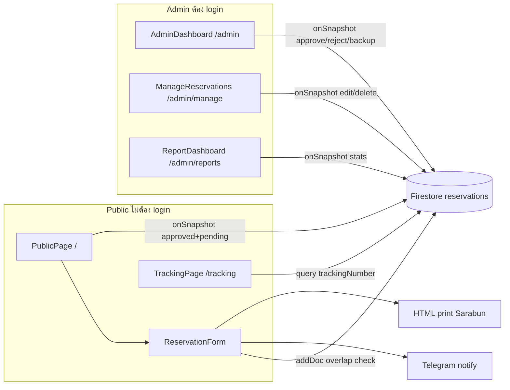

# ระบบจองห้องประชุม — อบจ. เชียงราย (Meeting Room Reservation System)

## ภาพรวม

แอปพลิเคชันจองห้องประชุมสำหรับองค์การบริหารส่วนจังหวัดเชียงราย ภาษาไทย UI สไตล์ราชการ แบ่งเป็น **ฝั่งประชาชน/หน่วยงาน** (ไม่ต้องล็อกอิน) และ **ฝั่งผู้ดูแล** (Firebase Authentication)

ข้อมูลการจองเก็บใน **Cloud Firestore** collection `reservations` แบบ real-time (`onSnapshot`) — ไฟล์ `src/lib/mockData.ts` เป็น **ค่าคงที่** (ห้อง, หน่วยงาน, สี, ช่วงเวลา) ไม่ใช่ข้อมูลจอง

---

## เทคโนโลยี

| ชั้น     | รายการ                                                                 |
| -------- | ---------------------------------------------------------------------- |
| Frontend | Vite, React 18, TypeScript, React Router                               |
| UI       | shadcn/ui, Tailwind CSS, Lucide icons                                  |
| ข้อมูล   | Firebase Firestore + Firebase Auth (`src/lib/firebase.ts`)             |
| Config   | ตัวแปร `VITE_*` ใน `.env.local` (ดู `.env.example`)                    |
| อื่น ๆ   | date-fns (+ locale `th`), พิมพ์แบบฟอร์ม HTML + Sarabun, Telegram Bot |

---

## สถาปัตยกรรมและกระแสข้อมูล

**สถานะการจอง (`status`)**

- `pending` — ส่งแบบฟอร์มแล้ว รออนุมัติ
- `approved` — อนุมัติแล้ว แสดงในปฏิทินสาธารณะ
- การ **ปฏิเสธ** จากแดชบอร์ดอนุมัติ = **ลบเอกสาร** ออกจาก Firestore (ไม่เก็บ `rejected`)

**หมายเลขติดตาม (`trackingNumber`)** — รหัส 5 ตัว (A–Z, 2–9 ไม่ใช้ O/0/I/1) ใช้ร่วมกันทุกวันเมื่อจองหลายวัน ค้นหาได้ที่ `/tracking`

---

## เส้นทาง (Routing) และ Layout

| Path             | Layout                | สิทธิ์        | หน้า                                                           |
| ---------------- | --------------------- | ------------- | -------------------------------------------------------------- |
| `/`              | `UserLayout`          | สาธารณะ       | `PublicPage` — ปฏิทิน + ฟอร์มจอง                               |
| `/login`         | —                     | สาธารณะ       | `LoginPage` — email/password → redirect `/admin` ถ้ามี session |
| `/tracking`      | `UserLayout`          | สาธารณะ       | `TrackingPage` — ติดตามสถานะด้วย tracking number               |
| `/admin`         | `AppLayout` + sidebar | `RequireAuth` | `AdminDashboard`                                               |
| `/admin/manage`  | `AppLayout`           | `RequireAuth` | `ManageReservations`                                           |
| `/admin/reports` | `AppLayout`           | `RequireAuth` | `ReportDashboard`                                              |

---

## Sidebar (ผู้ดูแล — `AppSidebar`)

1. **จองห้องประชุม** → `/`
2. **แดชบอร์ดสำหรับอนุมัติ** → `/admin`
3. **จัดการการจอง** → `/admin/manage`
4. **รายงานการจองห้องประชุม** → `/admin/reports`

---

## โครงสร้างข้อมูล Firestore (`reservations`)

| ฟิลด์                                         | คำอธิบาย                                     |
| --------------------------------------------- | -------------------------------------------- |
| `department`, `departmentOther`, `topic`      | หน่วยงาน (รองรับ "หน่วยงานอื่น ๆ"), เรื่อง    |
| `date`                                        | `yyyy-MM-dd` (หนึ่งเอกสารต่อหนึ่งวัน)        |
| `startTime`, `endTime`                        | ช่วง 08:00–18:00 ทีละ 30 นาที                |
| `room`                                        | ชื่อห้อง (หนึ่งใน 5 ห้อง)                    |
| `participants`                                | จำนวนผู้เข้าร่วม                             |
| `equipment`                                   | string[]                                     |
| `bookerName`, `bookerPosition`, `bookerPhone` | ผู้จอง                                       |
| `status`                                      | `pending` \| `approved`                      |
| `trackingNumber`                              | รหัสติดตาม                                   |
| `createdAt`                                   | `serverTimestamp()`                          |

**กฎธุรกิจ**

- ก่อนบันทึก: ตรวจ **overlap** เวลา (ห้อง + วันที่ + pending/approved)
- จองหลายวัน: หลาย `addDoc` แต่ `trackingNumber` เดียว
- เลือกห้อง **ธรรมรับอรุณ** → แสดง AlertDialog แจ้งประสานหน้าห้องนายก
- หลังบันทึก: Telegram หนึ่งครั้ง (ถ้าตั้ง env)

---

## หน้าสาธารณะ (`PublicPage` + `ReservationForm`)

- ปฏิทินเดือน/สัปดาห์, กรองห้อง, แสดง `approved` + `pending`
- ฟอร์มจองครบฟิลด์ → tracking number → พิมพ์แบบฟอร์ม (`generateReservationPDF`)

---

## พิมพ์แบบฟอร์ม (`pdfGenerator.ts`)

- เปิดหน้าต่าง HTML A4 แบ่ง 2 คอลัมน์ 50/50, เส้นแบ่งกลางเต็มความสูง
- ฟอนต์ `public/Sarabun-Regular.ttf`, `Sarabun-Bold.ttf`
- `@page` ขอบบน/ล่าง 10 mm
- ไม่ใช้ pdf-lib (ภาษาไทยผ่าน engine ของเบราว์เซอร์)

---

## แดชบอร์ด / จัดการ / รายงาน

- **AdminDashboard** — อนุมัติ pending, ปฏิเสธ = ลบ, สำรอง JSON, ปฏิทิน
- **ManageReservations** — ค้นหา กรอง แก้ไข overlap check ลบ
- **ReportDashboard** — สถิติ `approved` รายเดือน/รายปี

---

## ห้องประชุม (5 ห้อง)

| ค่า `room`   | หมายเหตุ                          |
| ------------ | --------------------------------- |
| ธรรมปัญญา    | 180–200 คน                        |
| ธรรมรับอรุณ  | 40–50 คน — แจ้งเตือนหน้าห้องนายก |
| ยอแสงธรรม    | 40–50 คน                          |
| รุ่งอรุณ     | 5–20 คน (เดิม `นครธรรม` ใน DB)    |
| เก้าจอม      | VIP                               |

---

## Deploy checklist

1. คัดลอก `.env.example` → `.env.local` / ตั้ง env บน CI
2. `npm run build` → deploy `dist/`
3. Firestore Rules + บัญชี admin ใน Auth
4. หมุน Telegram token ถ้าเคย commit ใน repo เก่า

---

## ไฟล์สำคัญ

| ไฟล์                        | บทบาท                          |
| --------------------------- | ------------------------------ |
| `src/App.tsx`               | Router, Auth                   |
| `src/pages/ReservationForm.tsx` | ฟอร์ม + Firestore          |
| `src/lib/mockData.ts`       | ค่าคงที่ระบบ                   |
| `src/lib/pdfGenerator.ts`   | พิมพ์แบบฟอร์ม                  |
| `src/lib/telegram.ts`       | แจ้งเตือน (env)                |
| `README.md`                 | คู่มือติดตั้งและ deploy        |
